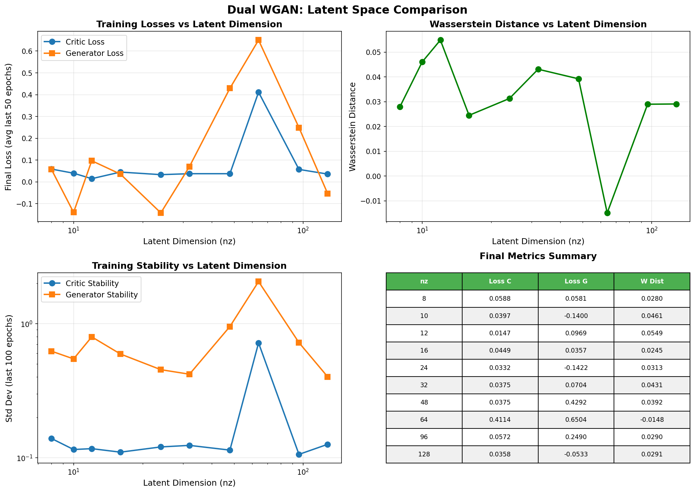

# Dual WGAN Latent Space Analysis

**Total Experiments:** 10

## Summary

| nz | Epochs | Final Loss C | Final Loss G | W Distance | Stability C | Stability G |
|---:|-------:|-------------:|-------------:|-----------:|------------:|------------:|
| 8 | 500 | 0.0588 | 0.0581 | 0.0280 | 0.1395 | 0.6243 |
| 10 | 500 | 0.0397 | -0.1400 | 0.0461 | 0.1153 | 0.5463 |
| 12 | 500 | 0.0147 | 0.0969 | 0.0549 | 0.1171 | 0.7975 |
| 16 | 500 | 0.0449 | 0.0357 | 0.0245 | 0.1102 | 0.5943 |
| 24 | 500 | 0.0332 | -0.1422 | 0.0313 | 0.1206 | 0.4541 |
| 32 | 500 | 0.0375 | 0.0704 | 0.0431 | 0.1238 | 0.4201 |
| 48 | 500 | 0.0375 | 0.4292 | 0.0392 | 0.1141 | 0.9522 |
| 64 | 500 | 0.4114 | 0.6504 | -0.0148 | 0.7189 | 2.0607 |
| 96 | 500 | 0.0572 | 0.2490 | 0.0290 | 0.1061 | 0.7224 |
| 128 | 500 | 0.0358 | -0.0533 | 0.0291 | 0.1261 | 0.4021 |

## Key Findings

### Best Configuration (by Wasserstein Distance)

- **nz=64**: W_dist=-0.0148

### Most Stable Training (by Generator Loss Stability)

- **nz=128**: Stability=0.4021

## Plots

