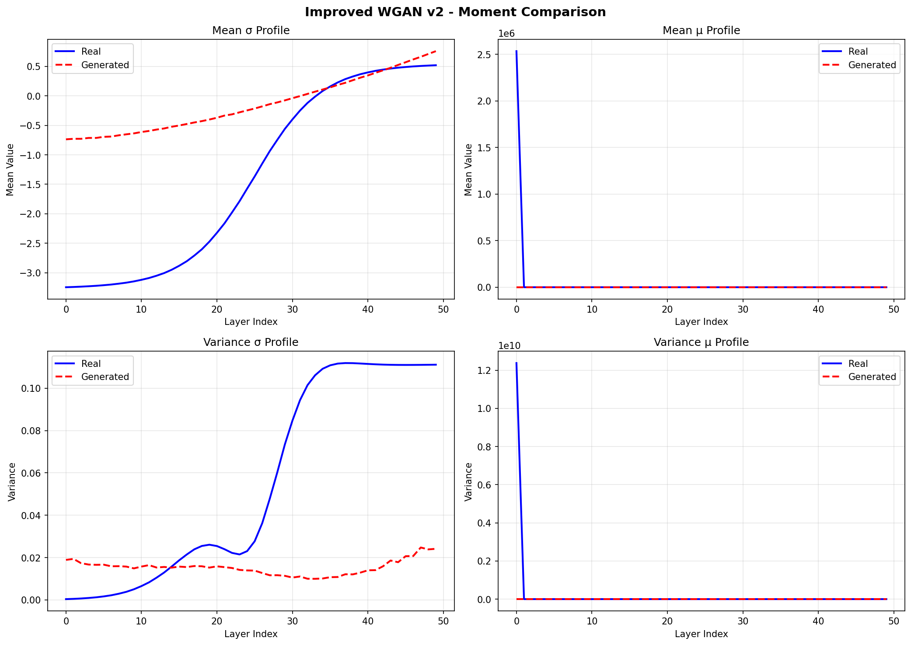
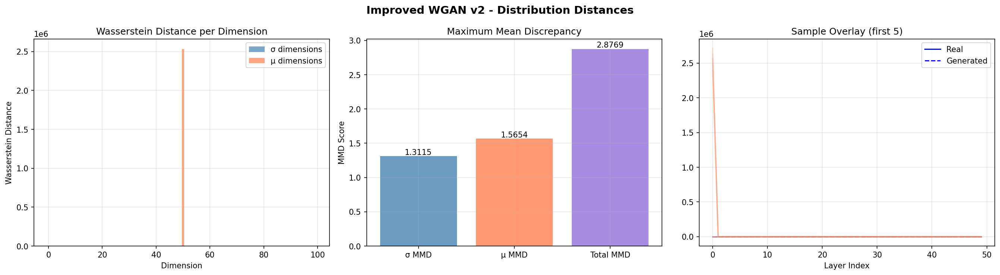
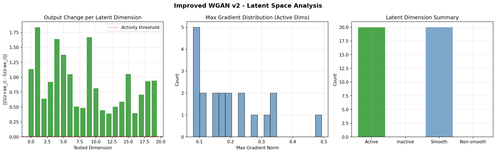
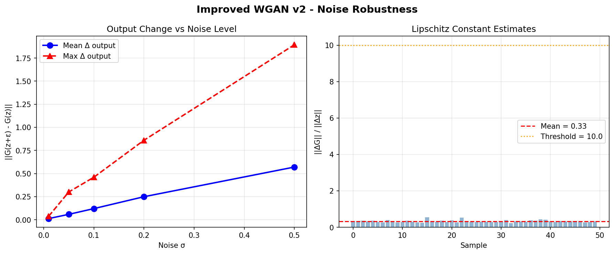

# GAN Quality Validation Report

**Model:** Improved WGAN v2
**Date:** 2026-02-12 19:49:17
**Overall Status:** FAIL
**Real samples:** 2000
**Generated samples:** 500
**K (layers):** 50
**nz (latent dim):** 100

---

## 1. Moment Matching (Mean & Variance Consistency) — FAIL

**Description:** Compares first-order (mean) and second-order (variance) statistics
between real and generated distributions. If E[x] ≈ E[x̂] and Var(x) ≈ Var(x̂),
the generator captures the central tendency and spread of the data.

| Metric | Value |
|--------|-------|
| Mean absolute difference | 25350.062135 |
| Mean relative difference | 0.8512 (85.12%) |
| Variance ratio (gen/real) | 73.0079 |
| Variance absolute difference | 123741513.500625 |
| Mode collapse detected | No |
| Noise amplification detected | Yes |

**Interpretation:**
- Variance ratio < 0.7 → mode collapse (generator produces too-similar outputs)
- Variance ratio > 1.6 → noise amplification (generator is unstable)
- Ideal variance ratio ≈ 1.0

---

## 2. Distribution Distances (Wasserstein & MMD)

**Description:** Measures how close the full generated distribution is to the real
distribution, beyond just first two moments.

### Wasserstein Distance (Earth Mover Distance)

Measures the minimum cost of transforming one distribution into another.
Lower values indicate closer distributions.

| Metric | Value |
|--------|-------|
| Mean Wasserstein distance | 25350.083553 |
| σ dimensions mean | 1.305001 |
| μ dimensions mean | 50698.862106 |

### Maximum Mean Discrepancy (MMD)

Kernel-based distance using Gaussian RBF kernel. MMD² = 0 iff distributions are identical.

| Metric | Value |
|--------|-------|
| Total MMD | 2.876888 |
| σ component | 1.311471 |
| μ component | 1.565417 |

---

## 3. Latent Space Traversal — PASS

**Description:** Tests smoothness and disentanglement by traversing individual
latent dimensions: z(α) = z₀ + α·eᵢ. A well-trained GAN should produce smooth
output changes. Sudden jumps indicate instability; no change indicates inactive dimensions.

| Metric | Value |
|--------|-------|
| Dimensions tested | 20 |
| Active dimensions | 20 |
| Smooth dimensions | 20 |
| Inactive ratio | 0.00 (0.0%) |
| Mean smoothness score | 1.0000 |

**Interpretation:**
- Inactive ratio > 50% → too many latent dimensions are unused (consider smaller nz)
- Low smoothness → generator has discontinuities in latent space

---

## 4. Physics Consistency — PASS

**Description:** Validates that generated profiles are physically plausible by:
1. Checking material property bounds (σ > 0, μ ≥ 1)
2. Running generated profiles through the Dodd-Deeds forward solver F(G(z))
   and verifying the impedance response is finite and comparable to real data.

### Bounds Check

| Metric | Value |
|--------|-------|
| Samples checked | 500 |
| σ in bounds ratio | 1.0000 (100.0%) |
| μ in bounds ratio | 1.0000 (100.0%) |
| σ positive ratio | 1.0000 |
| μ valid (≥1) ratio | 1.0000 |

### Forward Model Consistency

| Metric | Value |
|--------|-------|
| Samples tested | 20 |
| Valid responses | 20 |
| NaN responses | 0 |
| Inf responses | 0 |
| Mean |Z| | 8.913559e-01 |
| Std |Z| | 1.160264e+00 |
| Impedance real range | [-2.855272e-02, 2.321073e-02] |
| Impedance imag range | [-4.650075e-01, 5.034309e+00] |
| Reference |Z| (real data) | 5.904493e+02 |
| Amplitude relative error | 0.9985 (99.85%) |

**Interpretation:**
- All forward responses should be finite (no NaN/Inf)
- Generated impedance amplitude should be in same order of magnitude as real data

---

## 5. Noise Robustness — PASS

**Description:** Tests generator stability by injecting small perturbations
z' = z + ε where ε ~ N(0, σ²I). A robust generator satisfies:
||G(z') - G(z)|| ≤ C·||ε|| (bounded Lipschitz constant).

| Noise Level (σ) | Mean Δ Output | Max Δ Output |
|-----------------|---------------|--------------|
| 0.010 | 0.012187 | 0.037590 |
| 0.050 | 0.057903 | 0.299999 |
| 0.100 | 0.119941 | 0.459544 |
| 0.200 | 0.248771 | 0.860275 |
| 0.500 | 0.570103 | 1.894345 |

| Metric | Value |
|--------|-------|
| Mean Lipschitz estimate | 0.3266 |
| Robust (Lipschitz < 10) | Yes |

**Interpretation:**
- Lipschitz constant > 10 → small latent noise causes large output distortion
- Output change should scale approximately linearly with noise level

